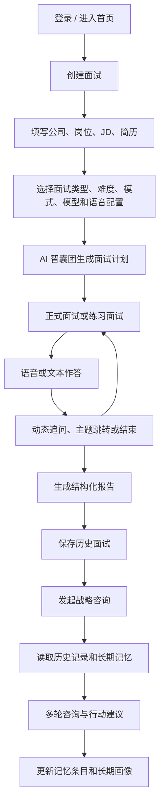

# 代面 Agents as an Interview 产品需求概览

## 一、产品定位

`Agents as an Interview` 是一款面向校招、实习、转岗和早期职场求职者的 AI 求职训练产品。它不只是单次模拟面试工具，而是把“面试前设计、面试中追问、面试后报告、长期战略咨询”串成一个闭环，帮助用户持续提升岗位匹配度、表达质量和求职决策能力。

V2.0 的核心升级是从单一 LLM 问答，升级为多 Agent 协作的求职训练系统：面试前由 AI 智囊团共同设计考察主题，面试中由自适应面试官动态追问，面试后通过结构化报告复盘，长期再由战略咨询 Agent 结合历史记录和记忆画像给出阶段性建议。

## 二、用户痛点与目标

### 1. 用户痛点

- 练习不真实：普通题库缺少语音、压力、追问和临场节奏。
- 复盘不具体：用户往往只知道“答得不好”，但不知道问题出在哪一段回答。
- 准备不连续：多次面试和咨询很难沉淀为长期画像，建议容易重复或遗失。
- 求职策略模糊：用户需要的不只是单场面试建议，还包括岗位方向、训练重点和下一步行动。

### 2. 产品目标

- 提供接近真实场景的 AI 模拟面试与练习面试，覆盖语音、倒计时、追问、主题跳转和结束判断。
- 基于简历、JD 和面试回答生成结构化报告，包含评分、证据批注、推荐回答和行为倾向分析。
- 通过 AI 智囊团从 JD、简历、策略、风险等视角设计面试主题，提高面试问题的覆盖度和真实感。
- 通过战略咨询 Agent 结合历史面试和长期记忆，持续输出求职诊断、方向判断和训练计划。
- 用结构化记忆和 compact profile 控制上下文长度，在保证个性化的同时提升稳定性和可扩展性。

## 三、核心用户与场景

| 用户类型 | 典型场景 | 产品价值 |
| --- | --- | --- |
| 校招/实习求职者 | 准备网申、群面、专业面、HR 面 | 快速发现表达短板和岗位匹配问题 |
| 转岗/换方向用户 | 判断岗位方向、优化项目叙事 | 结合历史记录给出阶段性策略 |
| 早期职场人 | 复盘真实面试、准备下一轮 | 形成可追踪的训练记录 |
| AI 产品/技术展示用户 | 展示 Agent 产品能力 | 体现多 Agent、语音、记忆、报告闭环 |

## 四、核心流程

## 五、功能需求

### 1. 首页与用户系统

- 首页提供面试训练和战略咨询两大入口，并支持中英文切换。
- 支持登录状态识别、用户数据隔离和历史记录归属管理。
- 用户只能查看和操作自己的面试、咨询、记忆和反馈数据。

### 2. 面试创建

- 支持输入公司、岗位、JD、简历和补充背景信息。
- 支持选择面试类型、难度、练习/模拟模式、AI 模型和语音配置。
- 支持简历解析，并将简历信息用于面试主题设计和报告分析。

### 3. AI 智囊团

- 面试开始前启动多 Agent 圆桌讨论。
- 角色包括 JD 解构官、简历深挖官、面试策略官、风险质疑官和主持人。
- 输出面试主题、主题优先级、开场问题、风险关注点和问题设计依据。
- 智囊团只用于面试计划生成等高价值环节，避免每轮面试都触发多 Agent 调用。

### 4. 面试执行

- 支持模拟模式和练习模式。
- 模拟模式强调真实压力，包含自动朗读、自动录音、倒计时和更少干预。
- 练习模式保留更多控制权，适合用户逐题打磨表达。
- 面试 Agent 根据回答质量、主题覆盖、难度上限和剩余轮次，动态判断继续追问、切换主题或结束。
- 系统需避免重复提问、无限追问和无效回答被直接保存。

### 5. 语音能力

- 支持豆包 ASR 语音识别和豆包 TTS 语音合成。
- 支持音色选择、自动朗读、自动录音和文本兜底输入。
- ASR 转写过程中需加提交锁：转写未完成时不得提交空回答；转写失败时提示用户重录或改用文本。

### 6. AI 报告

- 报告包含综合评分、维度评分、整体点评、逐轮反馈、智能批注和推荐回答。
- 核心评分维度包括岗位匹配度、回答完整度、逻辑性、专业度和沟通表达。
- 智能批注采用“系统预切片 + AI 选择证据片段”的方式，提高长回答下的证据匹配稳定性。
- 英文面试应生成英文报告，中文面试应生成中文报告，避免语言混杂。

### 7. 行为面与 MBTI 倾向报告

- 行为面报告基于本场回答证据判断表达倾向，不做绝对人格定型。
- 展示四组 MBTI 倾向、证据解释、岗位环境匹配、面试优势和潜在风险。
- 行为面同样保留动态追问能力，根据用户回答深挖关键经历。

### 8. 历史记录

- 历史面试支持查看、搜索、筛选、删除和发起战略咨询。
- 历史咨询支持查看、搜索、筛选、删除、记忆开关和完成状态展示。
- 已完成咨询不可继续对话，避免旧结论被误写成新上下文。
- 删除逻辑以用户视角为准：用户点击删除后，应从当前界面移除。

### 9. 战略咨询与长期记忆

- 咨询 Agent 基于用户选择的历史面试、当前问题、咨询上下文和长期记忆进行回复。
- 咨询体验以用户问题为主，优先回答当前问题，再补充历史证据和行动建议。
- 右侧记忆简报默认收起，展示已选面试、当前状态、长期画像、本次参考重点、已解决问题和依据来源。
- 记忆系统分为结构化记忆条目和 compact 长期画像，避免把完整历史聊天和报告反复塞进 prompt。

## 六、非功能需求

- 性能：面试、报告、咨询、语音和智囊团流程需有明确 loading 状态和真实进程反馈。
- 稳定性：ASR、TTS、LLM、SSE 失败时需有可理解提示，并避免保存错误状态。
- 安全：基于 Supabase Auth 和用户级数据隔离，前端只暴露必要的 anon key。
- 可用性：关键页面需有清晰返回、确认、继续、结束和发起咨询入口；中英文 UI 保持一致。
- 可维护性：Prompt、追问路由、报告批注、咨询 Agent、记忆压缩、数据持久化应模块化。
- 成本控制：多 Agent 用在面试计划生成，面试过程中使用单 Agent 动态路由，平衡质量和调用成本。
- 上下文控制：长期记忆默认采用 compact profile + 少量结构化证据，不直接注入完整历史。

## 七、涉及系统

- 前端：Next.js App Router、React、Tailwind CSS。
- AI 模型：DeepSeek V4 Pro / Flash，支持按场景选择模型。
- Agent 能力：AI 智囊团、动态追问 Agent、LangGraph 战略咨询 Agent。
- 语音：豆包 ASR、豆包 TTS、音色配置和转写提交锁。
- 报告：结构化评分、智能批注、推荐回答、行为面 MBTI 倾向报告。
- 记忆：`user_memory_items` 结构化记忆、`consult_memory_profiles` compact 长期画像。
- 数据：Supabase Auth、Supabase Database、用户级数据隔离、历史记录和体验评分。
- 部署：Vercel / Cloudflare 相关部署配置、环境变量管理和私有仓库协作。

## 八、产品价值

- 对用户：用更低成本获得接近真实面试的训练体验，并把每次练习转化为可执行的改进计划。
- 对产品：形成“多 Agent 面试设计 + 自适应追问 + 证据化报告 + 长期记忆咨询”的差异化闭环。
- 对技术展示：体现 AI Agent 编排、语音交互、结构化记忆、用户级数据隔离和端到端 SaaS 产品落地能力。

## 九、后续方向

- 强化报告可视化，展示智囊团预判主题与实际回答命中情况。
- 增加个人成长看板，追踪面试次数、得分变化、共性问题和训练进展。
- 完善移动端体验、更多登录方式、更多语音供应商和更多求职咨询技能。
- 探索更细粒度的记忆召回和轻量 Graph Memory，让长期咨询更个性化但不过度膨胀。
