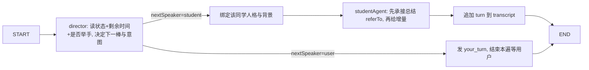

# 智能群面（AI 无领导小组讨论）产品方案

## 0. 一句话定位

> 智能群面是模拟面试模块下的一个新场景：用户填完简历与 JD 后，与 4–5 名性格、背景各异的 AI「同学」一起，围绕一道与公司和岗位强相关的讨论题，经历 **HR 开场 → 读题思考 → 自由讨论抢答 → 倒计时收尾 → 代表汇报 → 领导提问点评** 的完整无领导小组讨论流程，并在结束后获得「个人表现 + 群体协作」双视角的结构化报告。

它补齐了现有产品只覆盖「一对一面试」的空白，模拟真实群面中**互相抢答、互相补充、彼此总结、合力产出**的流程与氛围。

------------------------------------------------------------------------

## 1. 背景与边界澄清

### 1.1 与现有「AI 智囊团 / Council」的区别（重要）

当前代码库中已存在 `Council` / `智囊团` 概念（`app/api/session/council-stream`、`lib/prompts/generatePlan.ts`、`InterviewPlanCouncil` 类型）。**它和本方案的「智能群面」完全是两回事，不要混淆：**

| 维度 | AI 智囊团（已存在） | 智能群面（本方案，新增） |
|------------------------|------------------------|------------------------|
| 角色定位 | 面试**幕后**的多 Agent | 用户**亲自参与**的前台场景 |
| 发生时机 | 面试开始前，生成面试计划 | 一个独立的面试场景，全程进行 |
| 用户是否参与 | 否，用户只看结果动画 | 是，用户是讨论参与者之一 |
| 产出 | `InterviewPlan`（考察主题、开场问题） | 群面对话记录 + 双视角报告 |
| 复用关系 | —— | 复用其 SSE 流式编排、多角色 prompt 设计经验 |

为避免命名冲突，本功能对外统一称 **「智能群面」/「AI 群面」**，对内代码命名空间用 `groupInterview` / `group-interview`，**不要复用 `council` 前缀**。

### 1.2 现有可复用的基建

调研结论：本功能不需要新基建，可在现有能力上拼装。

-   **SSE 流式编排**：`app/api/session/council-stream/route.ts` 的 `ReadableStream` + `event:/data:` + `heartbeat` 模式可直接照搬，用于把「谁在发言、说了什么」逐条推给前端。
-   **数据持久化**：`lib/store.ts` + Supabase（`interview_sessions` 表）。群面新增一张表即可，模式一致。
-   **多音色 TTS**：`lib/voice/types.ts` 中 `DOUBAO_VOICES` 已有 30+ 个区分度高的男声/女声，足够给每位 AI 同学 + HR + 领导各分配一个独立嗓音；`pickRandomDoubaoVoice()` 可做去重随机分配。
-   **语音输入 ASR**：`lib/voice/doubaoAsr.ts` + `VoiceRecorder` 组件 + 提交锁逻辑可直接用于用户发言。
-   **人格系统**：`lib/personas.ts` 的 `PersonaDef` 结构可借鉴，扩展出「学生人格库」。
-   **入口编排**：`components/CreateForm.tsx`（填公司/岗位/JD/简历）→ `components/SetupFlow.tsx`（选配置）→ 路由跳转的两段式流程，可在此挂载新入口。
-   **模型层**：`lib/llm/models.ts`，群面所有 Agent 走同一套 provider 调用。

------------------------------------------------------------------------

## 2. 用户痛点与产品目标

### 2.1 痛点

-   群面是校招最高频、淘汰率最高的环节之一，但**几乎无法独自练习**：必须凑齐多人、找到题目、有人控场计时。
-   真实群面的难点不在「说什么」，而在**临场动态**：何时抢话、如何在别人基础上补充、如何总结收口、谁来汇报、如何应对领导追问。这些靠刷题和看经验帖学不会。
-   用户练完没有客观反馈：自己到底是「贡献者」「总结者」「领导者」还是「边缘人」，控场和倾听做得怎样，无人能评。

### 2.2 目标

-   用 4–5 个**性格多样**的 AI 同学营造真实群面氛围：有人爱抢话、有人爱总结、有人偏激进、有人偏稳健、有人偏数据。
-   让 AI 能力覆盖群面全流程关键动作：**抢答、引用并总结前序发言、补充新观点、适度反驳、推动共识、代表汇报、应对领导提问**。
-   AI 发言**既可先于也可后于用户**，由调度器动态决定，制造真实的「插话/被插话/接话」节奏。
-   产出**个人 + 群体双视角报告**：既评用户个人表现，也复盘整组讨论质量，并给出「下次怎么抢、怎么补、怎么收」的可执行建议。

------------------------------------------------------------------------

## 3. 角色体系

一场群面包含三类角色，**均以头像呈现**（头像/图片素材已就位于 `public/avatars/group-interview/`，见 8.2）。

### 3.1 AI 同学（固定 4 名，性格背景多样）

> 已确认：每场固定 **4 名 AI 同学 + 1 名用户 = 5 人小组**。

核心设计：每场从人格库中抽取 4 个 AI 同学，保证**性格组合有张力**（不能全是好好先生，也不能全是攻击型）。每个同学有：

-   头像、姓名（如「林同学/王同学」或化名）、独立 TTS 音色（头像与音色每场随机分配，仅需性别一致）。
-   **讨论人格**（行为风格）：决定发言频率、是否爱抢话、是否爱总结、攻击性强弱。
-   **背景画像**（专业/院校层次/经历倾向）：影响观点视角，制造多样性。

**TTS 音色池（已确认，每场随机抽取、性别匹配）：**

| 槽位 | 音色 id | 性别 |
| --- | --- | --- |
| 男 1 | `ICL_zh_male_shuanglangxiaoyang_cs_tob` | 男 |
| 男 2 | `en_male_jason_conversation_wvae_bigtts` | 男 |
| 男 3 | `ICL_zh_male_qinqiexiaozhuo_cs_tob` | 男 |
| 男 4 | `zh_male_xudong_conversation_wvae_bigtts` | 男 |
| 女 1 | `zh_female_qinqienvsheng_moon_bigtts` | 女 |
| 女 2 | `zh_female_linjianvhai_moon_bigtts` | 女 |
| 女 3 | `ICL_zh_female_qingyingduoduo_cs_tob` | 女 |
| HR / 主持人 | 爽快思思 `zh_female_shuangkuaisisi_moon_bigtts`（同一对一面试） | 女 |

> 实现注意：上表中除 `zh_female_linjianvhai_moon_bigtts` 与 `zh_female_shuangkuaisisi_moon_bigtts` 外，其余音色 id **当前不在 `lib/voice/types.ts` 的 `DOUBAO_VOICES` 列表中**（含 `ICL_*`、`*_conversation_wvae_bigtts`、`*_cs_tob` 新命名）。落地时需把这些音色注册进 `DOUBAO_VOICES` 并确认各自的 `resourceId`/模型版本可用，否则 TTS 会取不到资源。

建议的讨论人格库（`groupPersonas`）：

| 人格 | 行为特征 | 在讨论中的作用 |
|------------------------|------------------------|------------------------|
| 领跑者 (leader) | 爱第一个发言、主动定框架、推进节奏 | 抢开场、给讨论搭骨架 |
| 总结者 (synthesizer) | 善于归纳别人观点、找共识 | 频繁引用并总结前序发言 |
| 数据派 (analyst) | 重数据、重可行性、质疑空泛 | 提出量化/落地视角，适度反驳 |
| 激进派 (challenger) | 观点鲜明、爱抢话、敢反驳 | 制造冲突与压力，活跃气氛 |
| 稳健派 (supporter) | 温和、补充细节、附议+小修正 | 缓冲冲突、补全遗漏 |
| 边缘者 (quiet) | 发言少、需要被 cue 才说 | 真实还原「沉默成员」，给用户控场练习机会 |

每场抽取 4 个并保证至少包含一个「总结者」和一个「激进派」，与用户合计 5 人小组。

### 3.2 HR / 主持人（1 名）

开场出现：宣读规则、介绍题目、宣布各阶段时间、宣布讨论开始与结束。头像出现在开场与阶段切换时。一般不参与讨论内容。

### 3.3 领导 / 评委（仅汇报阶段出现，**不做实时语音追问**）

> 已确认：**领导提问环节不做实时交互/语音**，重点是同学之间的讨论与汇报。领导仅作为「报告中的视角」呈现。

- 汇报阶段领导头像可出现（视觉上营造「面向领导汇报」的压迫感），但不进行实时一问一答。
- 「领导视角点评」由报告 Agent 在结束后统一生成，直接写进报告（见第 6 节 `leaderFeedback`）。
- 因此流程中**取消独立的 leaderQA 交互阶段**，对应的 `leaderAgent` 也不再作为实时 Agent，只在生成报告时由报告 Agent 一并产出领导视角评价。

------------------------------------------------------------------------

## 4. 核心体验流程

``` mermaid
flowchart TD
  A[面试板块: 输入简历与JD] --> A2[选择 一对一面试 / 智能群面]
  A2 -->|智能群面| C[配置: 模型 + 试音/麦克风检查（音色不暴露给用户）]
  C --> D[生成群面: 随机抽取4名AI同学(头像+音色) 现场出题]
  D --> E[阶段1 HR开场: 介绍题目与规则 倒计时说明]
  E --> F[阶段2 读题思考: 全员静默 2分钟（表不暂停）]
  F --> PS[阶段3 个人陈述: 每人轮流 ≤2分钟 先表态(含用户)]
  PS --> G[阶段4 自由讨论: 抢答/接话/总结/反驳 6分钟硬走表]
  G --> H[阶段5 收尾共识: 提示剩余时间 推动结论]
  H --> I[阶段6 推选汇报人(用户/AI 二选一)]
  I --> J[阶段7 代表汇报: 面向领导 总结全组结论]
  J --> L[生成 个人+群体 双视角报告 含领导视角点评]
  L --> M[保存历史 可发起战略咨询]
```

### 4.1 阶段 1 — HR 开场

HR 头像（`host_opening-and-thinking.png`）居中显示，TTS 播报（音色：爽快思思）：欢迎语、题目朗读、规则说明（读题 2 分钟、个人陈述每人 ≤2 分钟、讨论 6 分钟、汇报）。前端展示题目卡片与倒计时预告。

### 4.2 阶段 2 — 读题思考

全员静默，屏幕高亮题目与背景材料，启动「思考倒计时」**2 分钟（不可暂停，硬走表）**。用户可在此期间记笔记（可选的便签输入框）。中央大图显示 `host_opening-and-thinking.png`。

### 4.3 阶段 3 — 个人陈述（已确认加入）

自由讨论前，全员轮流做个人陈述，**每人 ≤2 分钟**先亮明观点（含用户）。这一环节还原真实无领导小组讨论流程，并保证用户有一个固定、不被抢占的发言位。顺序由 director 安排（用户可被安排在中间或靠后，体验"听完几个人再轮到自己"）。AI 同学的陈述同样短、点明立场即可。

### 4.4 阶段 4 — 自由讨论（核心）

这是技术与体验的核心。机制：

-   **回合调度**：一个轻量「讨论调度器（director）」在每个发言位决定下一个发言者。规则综合：谁还没发言、人格的发言倾向、当前是否有人「抢话」、距离上次用户发言间隔、剩余时间。
-   **AI 可先可后**：开场可能是某个「领跑者」AI 先抛框架，也可能调度器把第一棒给用户；用户发言后，AI 会**接话**（先总结用户/前序观点，再补充或反驳）。
-   **用户抢答**：用户随时可点「举手/抢答」按钮（或长按麦克风）插入发言；调度器收到后让当前 AI 发言收尾，把下一棒交给用户。
-   **引用与总结**：每个 AI 发言的 prompt 强约束——**先用一句话承接/总结上一位（或几位）的观点，再给出自己的增量**，杜绝各说各话。
-   **真实节奏**：AI 发言短（2–4 句），偶有附议、反驳、补数据、cue 沉默的人（"刚才那位同学还没说，要不要补充？"），还原抢答氛围。
-   **硬走表（已确认）**：6 分钟讨论倒计时**全程不暂停**——用户思考、打字、录音期间表都在走，AI 也不会干等，可能继续发言/抢话。这是刻意保留的真实群面压力。
-   **流式呈现**：每条发言通过 SSE 逐条/逐字推送，配头像切换 + TTS 朗读 + 发言气泡。

### 4.5 阶段 5 — 收尾共识

剩余时间不足时，HR 或「总结者」AI 提示收口；AI 倾向于收敛分歧、形成结论清单。

### 4.6 阶段 6 — 推选汇报人

**已确认提供两种选项**： - **用户汇报**：用户代表小组面向领导汇报（更练表达）。 - **AI 汇报**：由「总结者/领跑者」AI 担任，用户旁听并仍获得汇报示范与质量参考。

### 4.7 阶段 7 — 代表汇报

汇报人面向领导，做结构化总结陈述（背景→共识结论→关键分歧→建议）。若用户汇报，则正常语音/文本作答并计时；若 AI 汇报，则生成一段标准汇报示范。

### 4.8 领导视角（已确认：不做实时交互，仅在报告中呈现）

不再设独立的「领导提问/点评」交互阶段。汇报结束即进入报告生成；报告中包含一段「领导视角点评」（针对汇报质量与全组讨论），由报告 Agent 统一生成。汇报阶段领导头像可作为视觉背景出现，但无语音问答。

------------------------------------------------------------------------

## 5. AI 编排与 Prompt 设计

### 5.1 Agent 角色

| Agent | 职责 | 调用频率 |
|------------------------|------------------------|------------------------|
| 出题 Agent (`topicAgent`) | 基于公司/岗位/JD 生成一道有讨论空间的群面题（含背景材料、隐含分歧点） | 每场 1 次（生成阶段） |
| 调度器 (`director`) | 每个发言位决定下一发言者与发言意图（开场/接话/反驳/总结/cue/收口） | 每回合 1 次（轻量、可用快模型） |
| 学生发言 Agent (`studentAgent`) | 以指定人格 + 背景，生成一条符合「先承接总结、再增量」的短发言 | 每个 AI 发言 1 次 |
| 汇报 Agent (`reporterAgent`) | 生成/示范结构化汇报（仅 AI 汇报时） | 0–1 次 |
| 报告 Agent (`groupReportAgent`) | 生成个人 + 群体双视角报告（含领导视角点评） | 结束后 1 次 |

> 已取消独立的实时「领导 Agent」；领导视角点评并入报告 Agent。
>
> 成本控制：`director` 与多数 `studentAgent` 用 Flash 级快模型，`topicAgent` / `groupReportAgent` 用 Pro 级。

### 5.2 调度器（director）输出契约

每回合输入：题目、人格列表、完整发言记录（compact）、剩余时间、用户是否举手。输出：

``` json
{
  "nextSpeaker": "student_3 | user | hr | leader",
  "intent": "open | build_on | challenge | summarize | cue_quiet | wrap_up | yield_to_user",
  "referToSpeakers": ["student_1", "user"],
  "reason": "上一位提出了成本视角，但没人补可行性，让数据派接",
  "shouldUserPromptToSpeak": true,
  "phaseHint": "discussion | wrap_up"
}
```

-   当用户举手 → 强制 `yield_to_user`，让当前 AI 短收尾。
-   当某 AI 长时间未发言 → 提高其被选中权重，或让他人 `cue_quiet`。
-   当剩余时间 \< 阈值 → 倾向 `summarize` / `wrap_up`。
-   `shouldUserPromptToSpeak` 控制前端是否高亮「该你发言了」。

### 5.3 学生发言 Agent 的硬约束

system prompt 关键约束：

1.  **必须先承接**：用 ≤1 句承接/总结被指向的前序发言（`referToSpeakers`），再给增量。
2.  **短**：2–4 句，口语化，符合群面语速；不写小作文。
3.  **守人格**：激进派敢反驳、总结者重归纳、数据派要数据，但都不攻击人身。
4.  **不重复**：不复述已说过的观点；可附议但要加新角度。
5.  **守边界**：紧扣题目与岗位语境，不跑题闲聊。
6.  **多样性**：与其他同学观点形成差异，避免全组同质。

### 5.4 出题 Agent

基于公司、岗位、JD **现场出题**（已确认：无固定题库），类型可在：开放策略题（"为某产品设计拉新方案"）、资源排序题（"给定 5 个项目，排优先级"）、两难抉择题（"扩张 vs 盈利"）、案例分析题之间按岗位选择。输出含：题干、背景材料、3–4 个隐含考察维度（供报告对照）。

> 场景定位（已确认）：主要面向**中国国央企及部分私企的校招无领导小组讨论**，核心考察**临场应变与行为能力**，而非专业知识题库。出题应贴合这一语境（题目偏开放、贴近业务、能引发分歧与协作）。

### 5.5 LangGraph 讨论循环编排（核心架构，已采纳）

讨论环节用 LangGraph 编排：**由图自己决定调用哪个性格去发言、互动或抢答，如此循环直到倒计时结束**。

落地关键——与现有代码库范式一致：现有 `lib/interview/langgraphAgent.ts` 的用法是**每回合 `graph.invoke(state)` 跑一遍、返回单步动作**（无常驻图、无 checkpointer）。群面沿用同一范式更稳、更省心，把「循环直到倒计时」拆成两层：

- **图（graph）= 一个发言位的决策与生成（单遍、无状态）**：输入当前讨论状态，输出「下一棒是谁 + 这一棒的发言内容（若是 AI）或让位给用户」。
- **外层循环 + 持久化 = 控制「直到倒计时结束」与「人在环」**：循环体放在 SSE handler / 编排层，每跑一次图就把新发言追加进 DB 的 `transcript`，再判断时间是否到、是否该让位用户；让位用户时暂停，等用户的 `/speak` 或 `/raise-hand` POST 后，再带着更新后的状态进下一次 `invoke`。

> 为什么不让图自己常驻死循环并用 `interrupt()` 等用户？因为那需要 checkpointer + 长连接挂起，和现有「单遍 invoke」范式不一致，且在 Serverless/Cloudflare 部署下长连接挂起风险高。把循环与「等用户」放在编排层，状态落 DB，更契合现有架构。

建议图结构（每回合一遍）：



外层循环伪代码：

```text
while (剩余讨论时间 > 0) {
  result = groupGraph.invoke(currentState)   // 单遍：director (+studentAgent)
  if (result.yieldToUser) {
     send your_turn; 暂停循环
     等待 /speak 或 /raise-hand → 把用户发言写入 transcript → 继续
  } else {
     send turn_start/turn_delta/turn_end (流式)
     可选 TTS 朗读；插入节奏延迟，避免刷屏
  }
  持久化 transcript 与 phase 到 DB
}
进入收尾/推选/汇报阶段
```

抢答语义：用户点「举手」时，向当前发言所在的循环发信号（DB 标志位 + SSE 端轮询/中断本遍后续 AI 连发），让下一个发言位强制 `yield_to_user`。

> MVP 即可采用此 LangGraph 编排（`@langchain/langgraph` 已是项目依赖，咨询与一对一面试均在用），无需先做「裸循环」再迁移。

------------------------------------------------------------------------

## 6. 数据模型

新增 Supabase 表 `group_interview_sessions`（结构对齐现有 `interview_sessions`），核心字段：

``` ts
type GroupInterviewSession = {
  id: string;
  ownerId: string;
  // 输入
  resume: string; company: string; jobTitle: string; jd: string;
  language: Language;
  // 配置
  groupSize: number;            // AI 同学数 4-5
  difficulty: Difficulty;
  durations: { think: number; discuss: number; report: number }; // 秒
  provider: string; model: string;
  voice: VoiceSettings;
  // 生成内容
  topic: GroupTopic;            // 题目 + 背景 + 考察维度
  members: GroupMember[];       // AI 同学 + 用户 的角色卡(含头像/音色/人格)
  // 过程
  phase: GroupPhase;            // opening|thinking|discussion|wrapup|electing|reporting|finished（无 leaderQA：领导仅在报告中体现）
  transcript: GroupTurn[];      // 每条发言
  reporterId: string | null;    // 汇报人(user 或某 student)
  // 产出
  report: GroupReport | null;
  status: SessionStatus;
  createdAt: number;
};

type GroupMember = {
  id: string;                   // user | student_1...
  kind: "user" | "student" | "hr" | "leader";
  name: string;
  avatarKey: string;            // 头像占位 key，后期映射真实素材
  voice: string;                // 豆包音色 id
  persona?: GroupPersonaId;     // 学生人格
  background?: string;          // 背景画像一句话
};

type GroupTurn = {
  index: number;
  speakerId: string;
  kind: "speech" | "hr" | "leader_question" | "report";
  intent?: string;              // director 给的意图
  referTo?: string[];           // 承接了谁
  text: string;
  ts: number;
};

type GroupReport = {
  // 个人视角
  personal: {
    overallScore: number;
    dimensions: Record<GroupDimension, ReportDimensionDetail>;
    roleTag: string;            // 本场你更像: 领导者/总结者/贡献者/边缘者
    strengths: string[]; weaknesses: string[]; advice: string[];
    keyMoments: { turnIndex: number; comment: string }[]; // 抓住/错过的关键时刻
  };
  // 群体视角
  group: {
    summary: string;
    consensus: string[]; disagreements: string[];
    collaborationScore: number;
    reportQuality: string;      // 汇报质量点评
  };
  leaderFeedback: string;       // 领导视角点评
};
```

群体评分维度建议（`GroupDimension`）：**观点质量、倾听与总结、推动与控场、协作与尊重、抢答时机、汇报表达**。

------------------------------------------------------------------------

## 7. API / SSE 设计

复用 `council-stream` 的流式范式，新增路由：

| 路由 | 作用 |
|------------------------------------|------------------------------------|
| `POST /api/group/session` | 创建群面会话：抽取同学、出题、写库，返回 `sessionId` |
| `GET /api/group/[id]/stream` | SSE：驱动讨论循环，逐条推送发言/阶段事件/计时 |
| `POST /api/group/[id]/speak` | 用户提交一条发言（文本或 ASR 转写），触发下一轮调度 |
| `POST /api/group/[id]/raise-hand` | 用户抢答：打断当前节奏，下一棒给用户 |
| `POST /api/group/[id]/advance` | 推进阶段（跳过思考/进入汇报等） |
| `POST /api/group/[id]/report` | 结束后生成双视角报告 |
| `GET /api/group/history` | 群面历史列表 |

SSE 事件类型（`event:` 名）：`phase_change`、`member_joined`、`turn_start`（含 speakerId，前端高亮头像）、`turn_delta`（流式文本片段）、`turn_end`、`timer`（倒计时同步）、`your_turn`（提示用户发言）、`report_ready`、`heartbeat`、`error`。

> 讨论循环放在 SSE handler 内：AI 连续发言之间插入短延迟（模拟真实语速、避免刷屏），遇到 `your_turn` 则暂停等待 `/speak` 或 `/raise-hand`。

------------------------------------------------------------------------

## 8. 前端与交互设计

### 8.1 群面房间布局（已确认：并排 + 中央大图，**不用圆桌**）

布局对齐一对一面试 `InterviewChat` 的「大图立绘 + 状态切换」思路，只是主角换成「当前发言人」：

-   **顶部**：阶段指示条（开场→读题→个人陈述→讨论→汇报）+ 当前阶段倒计时（讨论阶段硬走表，醒目）。
-   **学生头像条（并排）**：4 名 AI 同学头像**横向并排**显示（固定不动），当前发言的同学做高亮/放大标记。
-   **中央大图（核心，单张大图，平滑切换）**：根据当前状态显示不同图片，切换用淡入淡出/交叉过渡：
    -   开场 / 读题思考阶段 → `host_opening-and-thinking.png`
    -   某位 AI 同学发言 → 切换到该同学头像（`student_{male|female}_{n}.png`），平滑切过来
    -   **用户自己发言** → `user-speaking.png`
    -   收尾 / 结束 → `host_end.png`
-   **发言流**：中央大图下方/侧边时间线气泡，按发言顺序滚动；每条标注「谁 + 承接了谁」。
-   **用户操作区**：`举手抢答` 按钮（醒目）、麦克风（录音式，参考 1v1）、文本兜底输入、`我要汇报` 按钮（汇报阶段）。
-   **题目卡片**：可随时折叠查看题干与背景。

### 8.2 头像/图片素材（已就位）

素材已放在 `public/avatars/group-interview/`：

| 文件 | 用途 |
| --- | --- |
| `student_male_1/2/3.png` | 男同学头像（3 张） |
| `student_female_1/2/3.png` | 女同学头像（3 张） |
| `host_opening-and-thinking.png` | HR 开场 + 全员思考时的中央大图 |
| `host_end.png` | 收尾/结束时的中央大图 |
| `user-speaking.png` | 用户发言时的中央大图 |

-   **随机分配**：每场从 6 张学生头像中随机抽 4 张（构造多样性），并为每张头像分配一个**性别匹配**的音色（音色池见 3.1）；头像与音色都不让用户选、不在 UI 暴露。
-   注意：学生头像 6 张（3 男 3 女），音色池 7 个（4 男 3 女），抽取时按性别匹配、组内不重复即可。
-   状态→图片的映射建议封装成一个 `getGroupStageImage(phase, currentSpeaker)` 工具（对应 1v1 的 `getOpeningAvatarSrc / getEndingAvatarSrc`）。

### 8.3 氛围细节

-   中央大图切换用平滑过渡（crossfade），避免生硬跳变。
-   「正在输入…」气泡 + 学生头像条上的高亮跳动，模拟有人要发言。
-   抢答时短促提示音/动效，体现「被打断」。
-   多人音色不同，TTS 朗读时听感区分明显。

------------------------------------------------------------------------

## 9. 入口与现有系统结合点

1.  **入口链路（已确认）**：用户进入面试板块 → 输入简历与 JD（复用 `components/CreateForm.tsx`）→ **新增一步「选择面试形式：一对一面试 / 智能群面」** → 按所选形式进入各自后续链路。这一步插在 `CreateForm` 与配置页之间。
2.  **配置 + 试音（已确认）**：群面同样要走模型配置与试音/麦克风检查（复用 `SetupFlow` 的 device step 思路），但**音色不暴露给用户、UI 不呈现音色选择**——音色由系统按 3.1 音色池随机分配。可新建精简的 `GroupSetupFlow`（仅模型 + 试音 + 时长等），去掉音色选择项。
3.  **历史与咨询**：群面记录进入历史列表（与面试历史并列或加 tab），并支持基于群面报告发起战略咨询（复用现有 `consult` 链路，记忆条目扩展群面相关字段）。
4.  **i18n**：新增群面相关文案到 `lib/i18n.ts`，保持中英文一致。

------------------------------------------------------------------------

## 10. 分阶段落地

### MVP（第一阶段）— 跑通核心闭环

-   入口 + 配置 + 现场出题 + 抽取 4 名固定差异人格的 AI 同学（共 5 人）。
-   **LangGraph 单遍图 + 外层循环**的自由讨论：director 调度 + 学生发言 Agent + 用户发言 + 抢答（见 5.5）。
-   HR 开场（文本）、读题 2 分钟 + 讨论倒计时、用户或 AI 二选一汇报。
-   个人 + 群体报告（基础版，含领导视角点评，纯报告呈现、无实时领导问答）。
-   头像用占位，TTS 可选关闭。

### 第二阶段 — 真实感与多样性

-   完整 TTS 多音色朗读（按 3.1 音色池随机分配）+ 头像高亮声波动效 + 抢答动效。
-   学生人格库扩到 6 类，背景画像随机化，保证组合张力。
-   调度器优化：cue 沉默者、动态权重、收尾推动。
-   报告增加「关键时刻」复盘与角色标签（领导者/总结者/边缘者）。

### 第三阶段 — 精修

-   群面专项成长看板（多场群面角色变化、贡献度趋势）。
-   讨论节奏、抢答打断、并行预生成下一棒等性能与体验细化。

> 注：领导环节明确**不做**多评委、多轮实时追问（已确认），重点始终是同学之间的讨论与汇报。

------------------------------------------------------------------------

## 11. 风险与控制

| 风险 | 说明 | 控制方式 |
|------------------------|------------------------|------------------------|
| 成本/延迟 | 多 Agent 多回合调用 | 调度器与多数学生用快模型；发言短；并行预生成下一棒候选 |
| 刷屏过快 | AI 连续发言用户跟不上 | 发言间插入节奏延迟；流式逐条；用户可随时举手暂停 |
| 各说各话 | AI 不互相承接 | 学生 prompt 强约束「先承接总结再增量」+ director 指定 referTo |
| 同质化 | 全组观点雷同 | 人格+背景多样化；prompt 要求与他人差异化；去重检查 |
| 用户被边缘化 | AI 抢光发言位 | 调度器保证用户最小发言配额；定期 `your_turn`；醒目抢答入口 |
| 跑题 | 讨论偏离岗位 | 题目绑定 JD；prompt 守边界；HR/总结者适时拉回 |
| 时间失控 | 讨论不收尾 | 硬倒计时 + 剩余时间驱动 director 进入 wrap_up |
| 头像缺失 | 素材未就位 | 占位头像 + 映射表，素材到位后零逻辑改动替换 |

------------------------------------------------------------------------

## 12. 命名与代码落点建议

-   命名空间：`groupInterview` / `group-interview` / `/api/group/*`（**避开 `council`**）。
-   新增文件（建议）：
    -   `lib/groupInterview/groupPersonas.ts`（学生人格库）
    -   `lib/groupInterview/director.ts`（调度器）
    -   `lib/groupInterview/prompts/`（出题、学生、汇报、报告[含领导视角] prompt）
    -   `lib/groupInterview/graph.ts`（LangGraph 单遍图：director + studentAgent，见 5.5）
    -   `lib/groupInterview/store.ts`（会话持久化）
    -   `lib/groupInterview/types.ts`（本文档第 6 节类型）
    -   `app/api/group/...`（第 7 节路由）
    -   `app/group/[id]/page.tsx` + `components/GroupInterviewRoom.tsx`（房间 UI）
    -   `public/avatars/group-interview/`（头像/状态大图素材，已就位）
-   复用：SSE 模式（`council-stream`）、`store.ts` 写法、`DOUBAO_VOICES`、`VoiceRecorder`、`LoadingIndicator`、`lib/llm`、`lib/i18n`。

------------------------------------------------------------------------

## 13. 决策日志（已全部确认）

1.  **小组人数**：固定 **4 名 AI 同学 + 1 用户 = 5 人**。
2.  **入口链路**：进入面试板块 → 输入简历与 JD → **选择「一对一面试 / 智能群面」** → 各自后续链路。群面同样需模型配置 + 试音，但**音色不暴露给用户**，由系统随机分配。
3.  **流程与时长**：HR 开场 → 读题思考 **2 分钟** → **个人陈述（每人 ≤2 分钟，新增环节）** → 自由讨论 **6 分钟** → 收尾 → 推选汇报人 → 代表汇报 → 报告。
4.  **计时**：所有倒计时**硬走表**——用户思考、打字、录音期间均不暂停。
5.  **汇报人**：提供**两种选项**——用户亲自汇报 / 让 AI 同学代表汇报。
6.  **用户发言方式**：**语音优先（录音式，参考一对一面试的 `VoiceRecorder` + 提交锁）**，文本兜底。
7.  **语音**：默认开启豆包多音色 TTS；音色池与 HR 音色见 **3.1 节表格**；每场头像 + 音色随机分配、性别匹配，UI 不暴露选择。（实现需先把新音色 id 注册进 `DOUBAO_VOICES`）
8.  **头像/图片素材**：已就位于 `public/avatars/group-interview/`（6 张学生头像 + `host_opening-and-thinking` + `host_end` + `user-speaking`）。
9.  **UI 布局**：学生头像**并排**显示；中央单张大图按状态平滑切换（开场/思考→host 图、某同学发言→其头像、用户发言→user-speaking 图、结束→host_end 图）。**不用圆桌。**
10. **题型**：**无固定题库**，按公司 + JD 现场出题；场景为中国国央企及部分私企校招无领导小组讨论，考察临场应变与行为能力。
11. **领导环节**：**不做实时语音问答 / 不做多评委追问**，领导视角仅在报告中呈现。
12. **讨论编排**：**LangGraph 单遍图 + 外层循环 + DB 持久化**（见 5.5），MVP 即采用。
13. **汇报时长**：默认 2–3 分钟（如需调整再定）。

> 所有关键决策已确认，方案可进入开发。

------------------------------------------------------------------------

## 15. 实现进展（已落地，2026-06-13）

MVP 闭环已完整实现并通过类型检查、单元测试与生产构建。

### 15.1 与方案的一处架构调整

讨论循环最终采用**「每回合 POST」**而非 SSE 长连接：

- 现有一对一面试本身就是「每回合 POST `/answer`」，SSE 只用于智囊团一次性动画。群面是多回合短发言，**每回合 POST 更稳、在 Cloudflare/Serverless 上无长连接挂起风险**，与代码库一致。
- 「逐条呈现」由客户端轮流调用 `/turn` 并配合 TTS 串行播放 + 节奏延迟实现；「等用户 / 倒计时 / 抢答」由客户端编排，状态落 DB。
- **LangGraph 单遍图仍然保留**：`/turn` 每次调用 `runGroupTurn` → `groupTurnGraph.invoke`（director 决策 →（学生）发言生成），完全对齐方案 5.5 的「单遍 invoke」范式。

### 15.2 落地文件

- 后端：`lib/groupInterview/{types,groupPersonas,director,graph,store,scripts}.ts` + `lib/groupInterview/prompts/{shared,topic,student,reporter,report}.ts`
- 路由：`app/api/group/session`、`app/api/group/[id]/{turn,speak,advance,report}`、`app/api/group/history`
- 前端：`app/interview/choose`（1v1/群面选择）、`app/setup/group`（`GroupSetupFlow`）、`app/group/[id]`（`GroupInterviewRoom`）、`app/group/[id]/report`（`GroupReportView`）、`app/group/history`
- 入口改动：`CreateForm` 提交后跳 `/interview/choose`
- 数据 & 文案：`supabase/20260613_group_interview.sql`（+ `schema.sql`）、`lib/voice/types.ts` 注册群面音色池、`lib/i18n.ts` 新增 `group.* / groupSetup.* / interviewChoice.* / groupReport.* / groupHistory.*` 中英文案

### 15.3 上线前必做

1. 在 Supabase SQL Editor 执行 `supabase/20260613_group_interview.sql` 建表（生产库尚无 `group_interview_sessions`）。
2. 确认豆包账号已开通 3.1 节音色池中的全部 `speaker` id，并校验其 `resourceId`（新音色暂定 `seed-tts-2.0`，如取不到资源需调整 `lib/voice/types.ts`）。
3. 真机走查一遍完整链路（开场→读题→陈述→讨论→汇报→报告），确认 TTS 自动播放在首次用户手势后正常。

### 15.4 已知取舍（非阻塞）

- 群面记录复用「会话级」持久化（`group_interview_sessions`），未写入统一 `interview_history`；群面历史在独立的 `/group/history` 展示。
- 讨论倒计时在刷新后会重置为整段时长（未持久化 `discussionStartedAt`）；如需严格计时可后续加一个时间戳字段。
- 多 Tab 并发写 `transcript` 为「后写覆盖」（已加客户端提交锁防双击）；单客户端正常流程串行无此问题，如需强一致可加乐观锁版本号。

